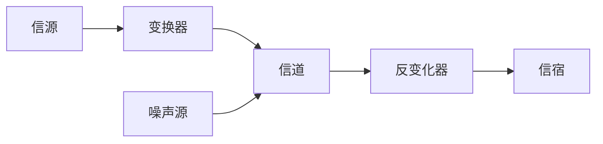

## 物理层
### 通信基础
**数据**：信息的载体，可分为数字数据和模拟数据。
**信号**：数据的电气或电磁表现，可分为数字信号 ( 分散 ) 和模拟信号 ( 连续 ) 。

用一个固定时长的信号波形表示一个 $k$ 进制符号，该波形称为**码元**(也称 $k$ 进制码元)，该时长称为**码元宽度**(或信号周期) 

数据通信系统

**信源**是产生和发送数据的源头
**信道**是信号的传输介质
**信宿**是接收数据的终点

信道分类
1.按传送信号分类：模拟信道，数字信道
2.按传输介质分类：无线信道，有线信道

信号分为**基带信号**和**宽带信号**
基带信号：是由信源发出的未经过调制的原始电信号，信道中直接传送基带信号称为基带传输。
宽带信号：是将基带信号调制到高频载波上形成的信号，信道中传送宽带信号成为宽带传输

数据传输分为**串行传输**和**并行传输**
串行传输：指逐比特按序依次传输(适用于长距离，如计算机网络)
并行传输：指若干比特通过多个通信信道同时传输(适用于软距离，如计算机内部：CPU与主存)

