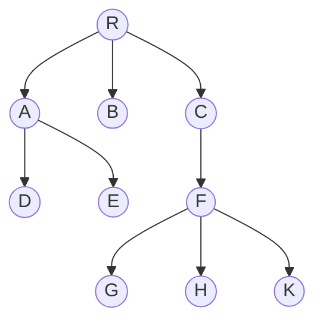
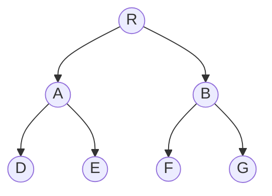
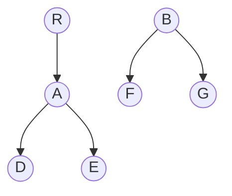
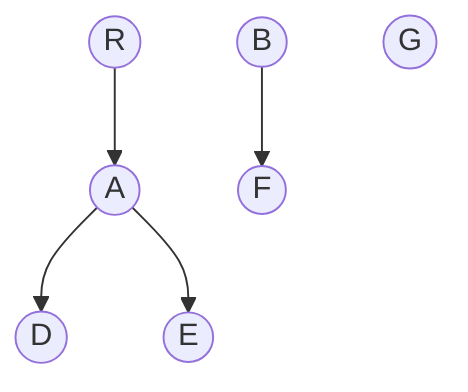
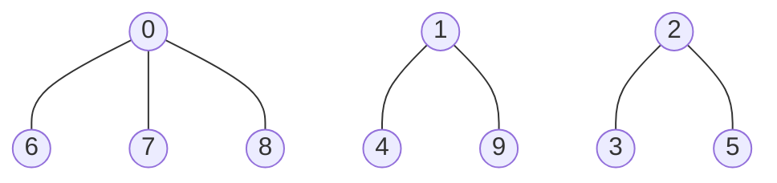
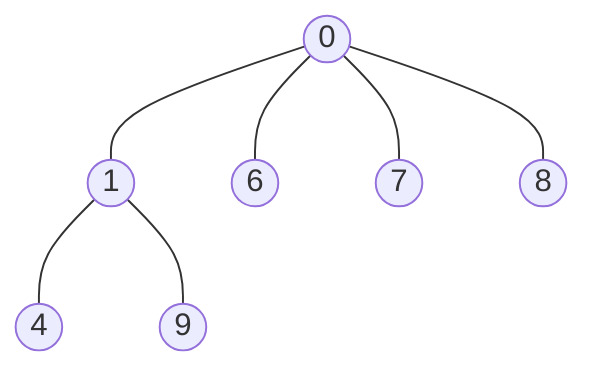

### 树
树的最基本性质
1.树的结点数 $n$ = 所有节点的度数之和 + 1
2.度为 $m$ 的树中，第 $i$ 层上最多有 $m^{i-1}$ 个结点
3.高度为 $h$ 的 $m$ 叉树至多有 $(m^h-1)/(m-1)$ 个结点
4.度为 $m$ 、具有 $n$ 个结点的树的最小高度为 $\lceil \log_2 (n(m-1) +1) \rceil$
5.度为 $m$ 、具有 $n$ 个结点的树的最大高度为 $n-m+1$

树的存储结构

1.双亲表示法
index|data|parent|
|:--:|:--:|:--:|
|0|R|-1|
|1|A|0|
|2|B|0|
|3|C|0|
|4|D|1|
|5|E|1|
|6|F|3|
|7|G|6|
|8|H|6|
|9|K|6|
```cpp
#define MAX_TREE_SIZE 100
typedef struct{
    ElemType data;
    int parent;
}PTNode;
typedef struct{
    PTNode nodes[MAX_TREE_SIZE];
    int n;
}PTree;
```
2.孩子表示法 （书P172）
将每个结点的孩子视为一个线性表，且以单链表作为存储结构，则 $n$ 个结点就有 $n$ 个孩子链表（叶结点的孩子链表为空表），而 $n$ 个头指针又组成一个线性表（可用顺序存储结构）
3.孩子兄弟表示法
也称二叉树表示法，即以二叉链表作为树的存储结构


---
### 二叉树

二叉树的类型：
1.满二叉树 2.完全二叉树 3.二叉排序树 4.平衡二叉树 5.正则二叉树（度只有0和2）

二叉树的基本性质
1.非空二叉树的叶结点数 = 度为 2 的结点数 + 1，即 $n_0 = n_2 +1$
2.非空二叉树的第 $k$ 层最多有 $2^{k-1}$ 个结点 （$k>=1$）
3.高度为 %h% 的二叉树至多有 $2^h-1$ 个结点
4.具有 $n$ 个结点的完全二叉树的高度为 $\lceil log_2(n+1) \rceil or \lfloor log_2n \rfloor +1$
5.在完全二叉树中：若 $i<= \lfloor n/2 \rfloor $ ，则 $i$ 为分支节点，否则为叶节点；叶节点只能在最后两层出现；最多只有一个度为1的结点，即最后一个分支结点 $\lfloor n/2 \rfloor$；若结点 $i$ 为叶节点或只有左孩子，后面的结点均为叶节点；若 $n$ 为奇数，所有分支结点都有左右孩子，若  $n$ 为偶数，编号最大的分支结点 $\lfloor n/2 \rfloor$ 只有左孩子，其他都有左右孩子；当 $i>1$ 时，结点 $i$ 的双亲结点为 $\lfloor i/2 \rfloor$；若结点 $i$ 的左孩子为 $2i$ ，右孩子为 $2i + 1$；结点 $i$ 所在的深度为 $\lfloor log_2i \rfloor 1$

二叉树的链式存储结构
```cpp
typedef struct BiTNode{
    ElemType data;
    struct BiTNode *lchild, *rchild;
}BiTNode, *BiTree;
```
创建二叉树
```cpp
void CreateBiTree (BiTree &T){
    char Ch; cin>>Ch;
    if(ch == '#'){
        T = NULL;
    }
    else{
        T = (BiNode*) malloc (sizeof(BiTree));
        T->data = ch;
        CreateBiTree(T->lchild);
        CreateBiTree(T->rchild);
    }
}
```

先序遍历
```cpp
void PreOrder(BiTree T){
    if(T!=NULL){
        cout<<T->data<<" ";
        PreOrder(T->lchild);
        PreOrder(T->rchild);
    }
}
```

中序遍历
```cpp
void InOrder(BiTree T){
    if(T!=NULL){
        InOrder(T->lchild);
        cout<<T->data<<" ";
        InOrder(T->rchild);
    }
}
```

后序遍历
```cpp
void PostOrder(BiTree T){
    if(T!=NULL){
        PostOrder(T->lchild);
        PostOrder(T->rchild);
        cout<<T->data<<" ";
    }
}
```

非递归中序遍历（考研高频，常用栈模拟递归）
```cpp
void InOrder(BiTree T){
    stack<BiTNode*> S;
    BiTree *p = T;
    while(p!=NULL && S.empty()){
        if(P!=NULL){
            S.push(p);
            p = p->lchild;
        }
        else{
            p = S.top();
            S.pop();
            cout<<p->data<<" ";
            p = p->rchild;
        }
    }
}
```
层次遍历（利用队列，逐层输出）
```cpp
void LevelOrder(BiTree T){
    if(T==NULL) return;
    queue<BiTree*> Q;
    Q.push(T);
    while(!Q.empty()){
        BiTNode *p = Q.front();
        Q.pop();
        cout<< p->data<<" ";
        if(p->lchild != NULL) Q.push(p->lchild);
        if(p->rchild != NULL) Q.push(p->rchild);
    }
}
```

求树的深度
```cpp
int Depth(BiTree T){
    if(T==NULL) return 0;
    int leftDepth = Depth(T->lchild);
    int rightDepth = Depth(T->rchild);
    return (leftDepth > rightDepth ? leftDepth : rightDepth) + 1;
}
```

求结点总数
```cpp
int NodeCount(BiTree T){
    if(T==NULL) return 0;
    return NodeCount(T->lchild) + NodeCount(T->rchild) + 1;
}
```

求叶节点个数
```cpp
int leafCount(BiTree T){
    if(T == NULL) return 0;
    if(T->lchild==NULL && T->rchild==NULL){
        return 1;
    }
    return leafCount(T->lchild) + leafCount(T->rchild);
}
```

求第 $k$ 层结点个数
```cpp
int levelNodeCount(BiTree T, int k){
    if(T==NULL || k<1) return 0;
    if(k==1) return 1;
    return levelNodeCount(T->lchild,k-1) + levelNodeCount(T->rchild,k-1);
}
```

在树中查找值为x的结点(先序查找)
```cpp
BiTNode* FindNode(BiTree T,ElemType x){
    if(T == NULL) return NULL;
    if(T->data == x) return;
    BiTNode *res = NULL;
    res = FindNode(T->lchild,x);
    if(res!=NULL) return res;
    return FindNode(T->rchild,x);
}
```

获取某个结点的双亲（父结点）
```cpp
BiNode* GetParent(BiTree T,BiTree *p){
    if(T==NULL || T==p || p==NULL) return NULL;
    if(T->lchild==p || T->rchild==p) return T;
    BiTNode *res = NULL;
    res = GetParent(T->lchild,p);
    if (res!=NULL) return res;
    return GetParent(T->lchild,p);
}
```

判断二叉树是否为完全二叉树（利用层次遍历思想）
```cpp
bool isCompleteBiTree(BiTree T){
    if(T==NULL) return true;
    queue<BiTNode*> Q;
    Q.push(T);
    bool mustHaveNoChild = false;
    while(!Q.empty()){
        BiTNode *p = Q.front;
        Q.pop();
        if(p==NULL){
            mustHavaNoChild = true;  //遇到空结点，后续必须全为空
        }
        else{
            if(mustHaveNoChild){
                return false;
            }
            Q.push(p->lchild);
            Q.push(p->rchild);
        }
    }
    return true;
}
```

---
### 线索二叉树
规定：若无左子树，令lchild指向其前驱结点；若无右子树，令rchild指向其后继结点
| lchild | ltag | data | rtag | rchild |
| :----: | :--: | :--: | :--: | :----: |
| 左孩子指针 | 0/1线索标记 | 数据域 | 0/1线索标记 | 右孩子指针 |

$$
ltag = 
\begin{cases}
0 &, lchild指向结点的左孩子\\
1 &, lchild指向结点的前驱
\end{cases}
$$

$$
rtag = 
\begin{cases}
0 &, rchild指向结点的右孩子\\
1 &, rchild指向结点的后继
\end{cases}
$$

线索二叉树的存储结构
```cpp
typedef struct ThreadNode{
    Elemtype struct data;
    struct ThreadNode *lchild,*rchild;
    int ltag,rtag;
}ThreadNode, *ThreadTree;
```

二叉树线索化（利用中序遍历）
```cpp
void InThread(ThreadTree &p,ThreadTree &pre){
    if(p!=NULL){
        InThread(p->lchild,pre);
        if(p->lchild == NULL){
            p->lchild = pre;
            p->ltag = 1;
        }
        if(pre!=NULL && pre->rchild==NULL){
            pre->rchild = p;
            pre->rtag = 1;
        }
        pre = p;
        InThread(p->rchild,pre);
    }
}
```

创建线索二叉树
```cpp
void CreateInTread(ThreadTree T){
    ThreadTree pre = NULL;
    if(T!=NULL){
        InThread(T,pre);
        pre->rchild = NULL;
        pre->rtag = 1;
    }
}
```

中序线索二叉树的遍历
1.求中序线索二叉树的中序序列下的第一个结点
2.求中序线索二叉树中结点p在中序序列下的后继
3.不含头结点的中序线索二叉树的中序遍历
```cpp
ThreadNode *FirstNode(ThreadTree *p){
    while(p->ltag == 0) p = p->lchild;
    return p;
}
ThreadNode *nextNode(ThreadTree *p){
    if(p->rtag==0) return FirstNode(p->rchild);
    else return p->rchild;
}
void Inorder(ThreadTree *T){
    for(ThreadNode *p = FirstNode(T); p!=NULL; p=nextNode(p)){
        visit(p);
    }
}
```
---
### 树、森林与二叉树的转换
1.树转换为二叉树
规则：每个结点的左指针指向它的第一个孩子，右指针指向它在书中的相邻右兄弟（左孩子，右兄弟）
2.森林转换为二叉树
规则：先将每一棵树转换为二叉树，再将各棵树的根看成兄弟结点，最终变成二叉树
3.二叉树转换为森林（唯一）
规则：若二叉树非空，则二叉树的根以及其左子树为第一颗树的二叉树形式，右子树视为除去第一颗二叉树的森林。继续断开，直到没有右子树





---
### 森林的遍历
1.先序遍历森林
访问森林中第一颗树的根结点
先序遍历第一棵树的根节点的子树森林
先序遍历剩下的森林

2.中序遍历森林
中序遍历森林中第一颗树的根结点的子树森林
访问第一棵树的根结点
中序遍历剩下的森林

---

### 树与二叉树的应用
1.哈夫曼树和哈夫曼编码
带权路径最小的二叉树称为哈夫曼树（也称最优二叉树）

2.并查集
存储结构：通常用树的双亲表示作为并查集的存储结构，每个子集以一棵树表示。所有表示子集合的树，构成表示全集合的森林，存放在双亲表示数组内。通常用数组元素的下标代表元素名，用根结点的下标代表子集合名，根结点的双亲域为负数
$$S_1 、 S_2、 S_3 $$

|0|1|2|3|4|5|6|7|8|9|
|:--:|:--:|:--:|:--:|:--:|:--:|:--:|:--:|:--:|:--:|
|-4|-3|-3|2|1|2|0|0|0|1|

$$ S_1 U S_2 $$


|0|1|2|3|4|5|6|7|8|9|
|:--:|:--:|:--:|:--:|:--:|:--:|:--:|:--:|:--:|:--:|
|-7|0|-3|2|1|2|0|0|0|1|


并查集的结构定义
```cpp
#define SIZE 100
int UFSets[SIZE];
```

初始化
```cpp
void Initial(int S[]){
    for(int i=0;i<size;i++){
        S[i] = -1;
    }
}
```

查找
```cpp
int Find(int S[],int x){
    while(S[x]>=0){
        x = S[x];
    }
    return x;
}
```


改进的查找(Find)操作
```cpp
int Find(int S[],int x){
    int root = x;
    while(s[root] >= 0){
        root = s[root];
    }
    while(x!=root){
        int t = S[x];
        S[x] = root;
        x = t;
    }
    return root;
}
```

并集操作
```cpp
void Union(int S[], int Root1, int Root2){
    if(Root1 == Root2) return;
    S[Root2] = Root1;
}
```

改进的并集(Union)操作
```cpp
void Union(int S[], int Root1,int Root2){
    if(Root1 == Root2) return;
    if(S[Root2] > S[Root1]){
        S[Root1] += S[Root2];
        S[Root2] = Root1;
    }
    else {
        S[Root2] += S[Root1];
        S[Root1] = Root2;
    }
}
```

